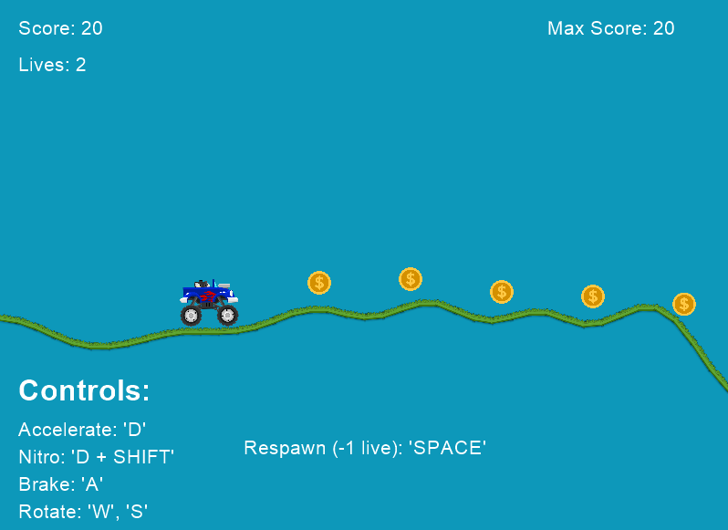

# Arcade Monster Truck Game



Este es un juego de simulación de monster truck en 2D donde los jugadores controlan un camión y navegan por un terreno accidentado y curvado mientras recolectan monedas.

## Cómo Jugar

1. Asegúrate de tener Python y las bibliotecas `arcade`, `pymunk`, `numpy` y `perlin_noise` instaladas en tu entorno.
   Para instalar las bibliotecas requeridas, ejecuta los siguientes comandos en tu terminal:

   ```bash
   pip install arcade
   pip install pymunk
   pip install numpy
   pip install perlin-noise
   
3. Clona o descarga este repositorio.
4. Ejecuta el archivo `main.py` con Python.

## Controles

- "W": Rotar el camión en sentido antihorario.
- "S": Rotar el camión en sentido horario.
- "A": Frenar el camión.
- "D": Acelerar el camión.
- "D" + "Shift": Usar el nitro para aumentar la velocidad.
- "Barra Espaciadora": Reiniciar el nivel o el juego en caso de Game Over.

## Objetivo

Recolecta la mayor cantidad de monedas posible mientras navegas por el terreno. Intenta mantener el camión en equilibrio y evita volcar. Si pierdes todas tus vidas, verás un mensaje de "Game Over", pero podrás reiniciar el juego presionando la barra espaciadora.

## Créditos

Desarrollado por:
- __Enrique Vicente__, Código: 61997
